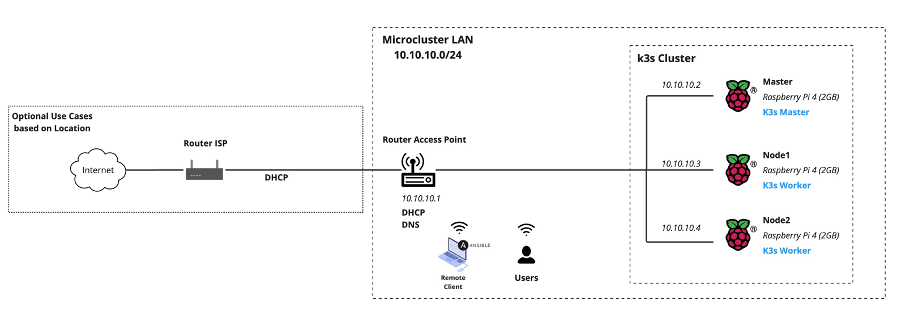

# Technical Documentation Microcluster K3s Raspberry Pi 4 Model B

## Table of Contents

- [Introduction](#introduction)
- [Hardware](#hardware)
- [Software](#software)
- [Topology](#topology)
- [Installation](#installation)

## Introduction

This is a technical documentation for the installation and configuration of a microcluster with 3 Raspberry Pi 4 Model B. This Microcluster is used for Capstone Project as a requirement to complete the Bachelor of Computer Engineering at Telkom University. The Capstone Project is entitled "Implementing a Micro Clustering as an Infrastructure as a Service (IaaS) to Improve the Effectiveness of Blended Learning in Rural Areas with a Learning Management System (LMS) Application".

The purpose of this microcluster is to provide a platform for the development of a Learning Management System (LMS) application that can be accessed by students in rural areas. The microcluster is built using the K3s distribution of Kubernetes. The microcluster is also equipped with a Longhorn storage system, MetalLB load balancer, Nginx Ingress Controller, and Cert-Manager for SSL certificate management.

After the capstone project is completed, this microcluster will be used as a Home Lab for the author's personal projects. The author will also continue to develop this microcluster by adding more nodes and other features.

## Hardware

The following hardware is used for the microcluster:

- 3x Raspberry Pi 4 Model B
- 3x Micro SD Card 32GB
- 3x Power Supply 5V 3A USB-C
- 4x Ethernet Cable
- 3x Dual Fan Heatsink for Raspberry Pi 4 Model B
- 1x Router Access Point
- Thermal Pad
- Raspberry Pi 4 Stackable Case

## Software

The following software is used for the microcluster:

- Ubuntu Server 20.04.2 LTS
- K3s
- Helm
- MetalLB
- Longhorn
- Nginx Ingress Controller
- Cert-Manager

## Topology



## Installation

### Ubuntu Server 20.04 LTS

Download Raspberry Pi Imager from [here](https://www.raspberrypi.com/software/.). Select Ubuntu Server 20.04 LTS, configure the SSH and User Settings and write the image to the SD Card.

#### Configure Ubuntu Server

After the installation of Ubuntu Server, login with the user and password configured in the Raspberry Pi Imager. Configure the network interfaces on each node with a static IP address.

```bash
sudo nano /etc/netplan/50-cloud-init.yaml
```

- Master Node

```yaml
network:
  version: 2
  ethernets:
    eth0:
      dhcp4: false
      addresses:
        - 10.10.10.2/24
      gateway4: 10.10.10.1
      nameservers:
        addresses: [8.8.8.8, 1.1.1.1]
```

- Worker1 Node

```yaml
network:
  version: 2
  ethernets:
    eth0:
      dhcp4: false
      addresses:
        - 10.10.10.3/24
      gateway4: 10.10.10.1
      nameservers:
        addresses: [8.8.8.8, 1.1.1.1]
```

- Worker2 Node

```yaml
network:
  version: 2
  ethernets:
    eth0:
      dhcp4: false
      addresses:
        - 10.10.10.4/24
      gateway4: 10.10.10.1
      nameservers:
        addresses: [8.8.8.8, 1.1.1.1]
```

Apply the changes.

```bash
sudo netplan apply
```

#### Remove Default Snap Package each Node

```bash
snap remove lxd && snap remove core20 && snap remove snapd
sudo apt purge snapd
sudo apt autoremove
```

#### Load `br_netfilter` Kernel Module each Node

```bash
cat <<EOF | sudo tee /etc/modules-load.d/k8s.conf
br_netfilter
EOF
```

#### Modify `sysctl` Settings each Node For Kubernetes Networking

```bash
cat <<EOF | sudo tee /etc/sysctl.d/k8s.conf
net.bridge.bridge-nf-call-ip6tables = 1
net.bridge.bridge-nf-call-iptables = 1
EOF
sudo sysctl --system
```

#### Change Default GPU Memory Split each Node

```bash
sudo nano /boot/firmware/usercfg.txt

# Add the following line
gpu_mem=16
```

#### Enable Cgroups each Node

```bash
sudo nano /boot/firmware/cmdline.txt

# Add the following line
cgroup_enable=cpuset cgroup_memory=1 cgroup_enable=memory
```

#### Reboot each Node

```bash
sudo reboot
```

### K3s

#### Setup Kubelet Service each Node

```bash
sudo mkdir -p /etc/rancher/k3s/ && sudo nano /etc/rancher/k3s/kubelet.config

# Add the following lines
apiVersion: kubelet.config.k8s.io/v1beta1
kind: KubeletConfiguration
shutdownGracePeriod: 30s
shutdownGracePeriodCriticalPods: 10s
```

#### Install K3s Master Node

```bash
curl -sfL https://get.k3s.io | K3S_TOKEN=<TOKEN-HERE> sh -s - server \
--write-kubeconfig-mode '0644' \
--node-taint 'node-role.kubernetes.io/master=true:NoSchedule' \
--disable 'servicelb' \
--disable 'traefik' \
--disable 'local-path' \
--kube-controller-manager-arg 'bind-address=0.0.0.0' \
--kube-proxy-arg 'metrics-bind-address=0.0.0.0' \
--kube-scheduler-arg 'bind-address=0.0.0.0' \
--kubelet-arg 'config=/etc/rancher/k3s/kubelet.config' \
--kube-controller-manager-arg 'terminated-pod-gc-threshold=10'
```

#### Install K3s Worker1 & Worker2 Node

```bash
curl -sfL https://get.k3s.io | K3S_URL='https://10.10.10.2:6443' K3S_TOKEN=<TOKEN-HERE> sh -s - \
--node-label 'node-type=worker' \
--kubelet-arg 'config=/etc/rancher/k3s/kubelet.config' \
--kube-proxy-arg 'metrics-bind-address=0.0.0.0'
```

#### Get K3s Kubeconfig from Master Node

```bash
sudo cat /etc/rancher/k3s/k3s.yaml
```

#### Install Kubectl on Local Machine

```bash
curl -LO "https://dl.k8s.io/release/$(curl -L -s https://dl.k8s.io/release/stable.txt)/bin/linux/arm64/kubectl"
```

```bash
sudo install -o root -g root -m 0755 kubectl /usr/local/bin/kubectl
```

```bash
kubectl version --client
```

#### Configure Kubecofig on Local Machine

```bash
mkdir -p ~/.kube
```

```bash
nano ~/.kube/config
```

Paste the content of the k3s.yaml file from the master node.

#### Check K3s Cluster

```bash
kubectl get nodes
```


### Helm on Local Machine

```bash
curl -fsSL -o get_helm.sh https://raw.githubusercontent.com/helm/helm/main/scripts/get-helm-3
chmod 700 get_helm.sh
./get_helm.sh
```

```bash
helm version
```

### Longhorn

```bash
helm repo add longhorn https://charts.longhorn.io
helm repo update
kubectl create namespace longhorn-system
helm install longhorn longhorn/longhorn --namespace longhorn-system
```

### MetalLB

```bash
helm repo add metallb https://metallb.github.io/metallb
helm repo update
```

create `values.yaml` file

```yaml
# Metallb address pool
apiVersion: metallb.io/v1beta1
kind: IPAddressPool
metadata:
  name: picluster-pool
  namespace: metallb
spec:
  addresses:
    - 10.10.10.100-10.10.10.150

---
# L2 configuration
apiVersion: metallb.io/v1beta1
kind: L2Advertisement
metadata:
  name: example
  namespace: metallb
spec:
  ipAddressPools:
    - picluster-pool
```

```bash
helm install metallb -f values.yaml metallb/metallb --namespace metallb-system --create-namespace
```

### Ngix Ingress Controller

```bash
helm repo add ingress-nginx https://kubernetes.github.io/ingress-nginx
helm repo update
kubectl create namespace ingress-nginx
helm install ingress-nginx ingress-nginx/ingress-nginx --namespace ingress-nginx
```

### Cert-Manager

```bash
helm repo add cert-manager https://charts.jetstack.io
helm repo update
kubectl create namespace cert-manager
helm install cert-manager --namespace cert-manager --version v1.12.2 --set installCRDs=true cert-manager/cert-manager
```

## Author

- [Ahmad Naoval Annasik](https://github.com/nvlannasik)
- Mohammad Rayhan Aryana
